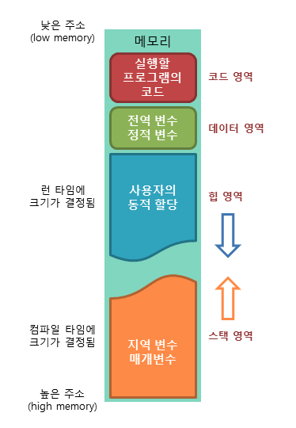

# 메모리란?

저번 [컴퓨터 구조](https://bbackjk.github.io/computing/computing-memory-structure/) 시간에 배운 것을 상기시켜보자면 메모리는 **기억 장치**이며 **데이터를 저장** 하는 녀석이다.

우리가 프로그램을 만들어서 실행을 하면 이 **메모리** 라는 녀석에게 코드들이 올라가서(**load**) 실행되는 것.

프로그램이 운영체제(OS)로부터 할당받는 대표적인 메모리 공간은

1. 코드(code) 영역
2. 데이터(data) 영역
3. 스택(stack) 영역
4. 힙(heap) 영역

이다.

> 참고 tcpschool.com

그럼 하나부터 파헤쳐보자.

## 1. 코드(code) 영역

실행할 프로그램의 코드가 **저장**되는 영역으로 ``텍스트(code)`` 영역이라고도 한다.

CPU는 이 코드 영역에 저장된 명령어를 하나씩 가져가서 처리한다.

## 2. 데이터(data) 영역

프로그램의 ``전역 변수`` 와 ``정적(static) 변수`` 가 저장되는 영역.

이 영역은 프로그램의 **시작과 함께 할당** 되며, 프로그램이 종료되면 소멸한다.

## 3. 스택(stack) 영역

함수의 호출과 관계되는 ``지역 변수`` 와 ``매개 변수`` 가 저장되는 영역.

이 스택 영역은 **함수의 호출과 함께 할당** 되며, 함수의 호출이 끝나면 소멸. (main 함수에서 시작, 종료)

스택 영역의 기본적인 동작 방식은 ``LIFO``로 **Last-In First-Out** 방식에 따라 동작.

스택 영역은 메모리의 **높은 주소에서 낮은 주소의** 방향으로 할당 된다.

## 4. 힙(heap) 영역

사용자가 직접 관리할 수 있는 **(관리를 해야만 하는)** 영역이다.

> 그만큼 중요하시단 거지~ --> 자바는 ``Garbage Collection``이 따로 관리!

힙 영역은 사용자에 의해 메모리 공간이 동적으로 할당되고 해제됩니다.

또한 스택 영역과는 반대로 **낮은 주소에서 높은 주소의** 방향으로 할당 됩니다.

 

## 왜 할당되는 방향이 다를까요?

바로 버퍼오버플로우 **(Buffer OverFlow)** 를 막기 위해서다.

왜 막을까?

스택 영역 뒤에는 ``커널이 있기 때문``

이게 왜 위험할까?

일부러 데이터의 영역을 **오버플로우** 하여 커널에 가서 데이터를 조작하기 때문이다.

이로써 전체적인 메모리가 어떻게 **구성되어있는지, 어떻게 할당되어지는지**를 알아보았다.

다음에는 자바에서 변수를 할당하면 어떤식으로 할당되어지는지 구체적으로 알아보자...

